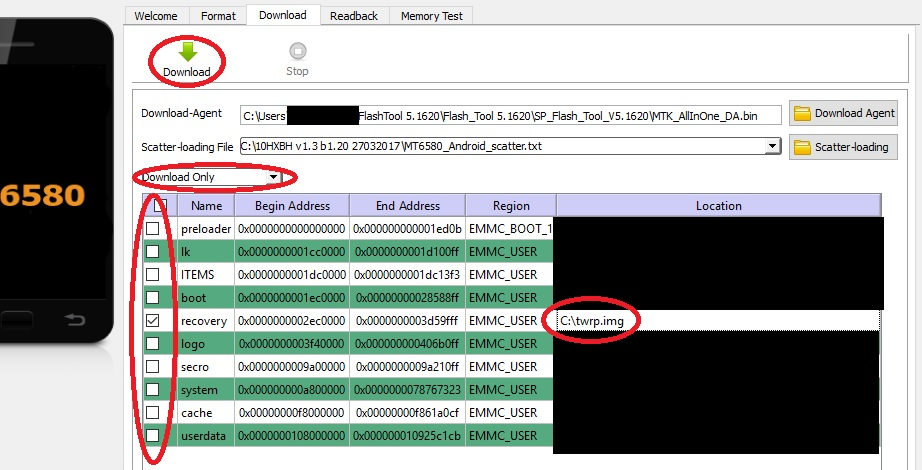

# TWRP 3.2.1-0 for Mediacom Hx 10 HD (M-SP10HXBH) revision 1704

A ported version of TWRP made during my spare time for a tablet distribuited by Mediacom Europe.

## Status
Zip flash, clean cache/dalvik cache and ADB Sideload are working, not sure about the rest.
No source code is provided at the moment (it's a port), so I can't directly fix any sort of bug you can discover.

## Port guide

0. Unlock your bootloader. There're plenty of tutorials around the net, just search "Unlock bootloader Marshmallow". No unlock code is required. You'll lose your warranty.

1. Check if your tablet is a revision 1704 one looking at its serial number. You can find it on the back cover, and must corresponds to `S\N:SP10HXBH1704******`

2. Dowload the latest firmware for your device from [Mediacom official website](https://www.mediacomeurope.it/tablet/scheda.aspx?XRI=67).

	- As of November 2018, v1.3 build 1.20 is the most recent firmware available for download.
	- Ignore v3.7 and v3.9 build 3.00, they're not for revision 1704 but 1711/1801.

3. From the same page linked in step 2, download SP Flash Tool 5.1620

4. Download [Carliv Image Kitchen](https://gitlab.com/carliv/carliv_image_kitchen) for your SO (Windows/Linux x86/x64)

5. Download an already compiled TWRP recovery [like this one](https://www.androidgsmbd.com/twrp-3-2-1-0-recovery-for-mt6580-kernel-3-18-19-mm/)

- Must be made for MediaTek MT6580-powered devices (this tablet uses MT8321AB, which is a rebranded MT6580)
- Must be made for an Android Marshmallow 6.0.1 based firmware (not sure about this requirement)
- Must be version 3.0 at least (due to a problem with fstab format on older versions)

6. Extract recovery.img and MT6580_android_Scatter.txt from the firmware archive downloaded at step 2

7. Rename "recovery.img" to "stock.img" and the TWRP img to "twrp.img"

8. Unpack Carliv Image Kitchen and copy both the img files in the "recovery-resources" subdirectory

9. Open Carliv Image Kitchen and unpack both the recoveries; two new subdirectories named "stock" and "twrp" will be created

10. Copy and overwrite the following files from "stock" to "twrp"

	- stock/recovery.img-kernel --> twrp/recovery.img-kernel
	- stock/ramdisk/etc/recovery.fstab --> twrp/ramdisk/etc/recovery.fstab
	- stock/ramdisk/fstab.mt6580 --> twrp/ramdisk/fstab.mt6580

11. Repack the TWRP recovery with Carliv Image Kitchen. A new .img file will be created in the "output" directory.

12. Open SP Flash Tool, load the previoulsy saved MT6580_android_Scatter.txt extracted from the firmware archive, untick everything except for Recovery,
choose the TWRP image created, set Download Only mode and press Download.

13. Connect your tablet (must be turned-off) via USB and wait for the end of the flashing procedure

14. Remove the USB cable, keep pressed Vol+ and Power buttons for 10 seconds and choose Recovery in order to start TWRP

## Other revisions of the same model/tablet models by Mediacom

I don't konw if this porting guide is working. Maybe yes, maybe no.

## Acknowledgements

A big thank you to [RAFAYEL7Zero](https://www.youtube.com/channel/UCQYEuQ9wtnlqSHXB1e3JQDA/) for his video guide [How to Port TWRP Recovery any MTK](https://www.youtube.com/watch?v=NC77TOde-GI), the TWRP team, Carliv and the guys who ported this recovery for the MT6580 for their wonderful job
